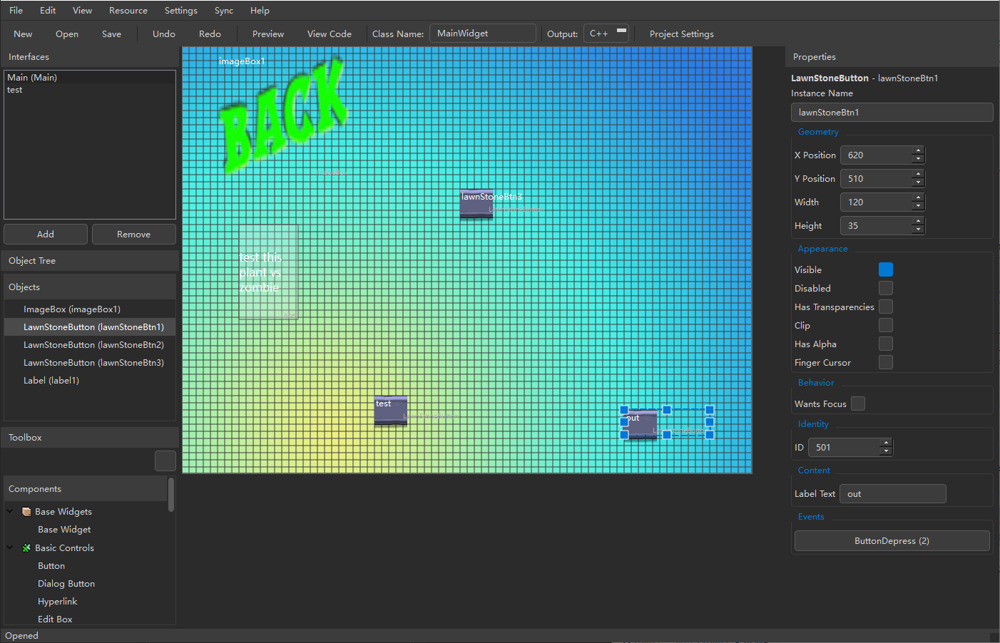

# SexyUI Editor

A visual UI editor for the Sexy framework used in Plants vs. Zombies, supporting both C++ and C# (.NET) code generation.


## Features

- 🎨 **Visual Design**: Drag-and-drop interface for UI layout design
- 🔄 **Dual Platform Support**: Generate code for both C++ and C# (.NET) versions
- 🖼️ **Resource Management**: Built-in image and font resource browser with preview
- 📝 **Code Generation**: Automatic code generation with user code preservation
- 🔌 **Extension System**: Support for custom extension components
- 🌍 **Internationalization**: Multi-language support (English/Chinese)
- 🎯 **Event System**: Visual event configuration with predefined actions
- 📦 **Atlas Support**: Automatic Atlas sub-image detection and preview for .NET version

## Screenshots



## Getting Started

### Prerequisites

- Python 3.8 or higher
- PyQt6
- Windows OS (tested on Windows 10/11)

### Installation

1. Clone the repository:
```bash
git clone https://github.com/yourusername/SexyUIEditor.git
cd SexyUIEditor
```

2. Install dependencies:
```bash
pip install PyQt6
```

3. Run the editor:
```bash
python main.py
```

## Usage

### Creating a New Project

1. Click **File → New** or press `Ctrl+N`
2. Select target platform (C++ or C#)
3. Design your interface using the component toolbox
4. Configure widget properties in the property panel
5. Save the project with `.sexyui` (C++) or `.cssexyui` (C#) extension

### Designing Interfaces

- **Add Widgets**: Drag components from the toolbox to the canvas
- **Select Widgets**: Click on widgets to select them
- **Move Widgets**: Drag selected widgets to reposition
- **Resize Widgets**: Use the resize handles on selected widgets
- **Delete Widgets**: Press `Delete` key or use Edit menu

### Code Generation

1. Press `F6` or click **View → View Code** to preview generated code
2. Click **View → Export All Interfaces...** to export all interfaces
3. Generated code preserves user modifications in marked regions

### Event Configuration

1. Select a widget in the object tree or canvas
2. Click the event button in the property panel
3. Add predefined actions or write custom code
4. User code is preserved in `// [[[HANDLER_xxx]]]` regions

## Project Structure

```
SexyUIEditor/
├── core/                    # Core business logic
│   ├── generators/          # Code generation modules
│   ├── component_registry.py # Widget definitions
│   ├── extension_manager.py # Extension component management
│   └── i18n.py              # Internationalization
├── ui/                      # User interface components
├── Content/                 # .NET game resources
├── SexyUIExtensions/        # Extension components
├── docs/                    # Documentation
└── main.py                  # Application entry point
```

## Supported Widgets

### Basic Widgets
- ButtonWidget - Basic button
- EditWidget - Text input
- Checkbox - Checkbox control
- Slider - Slider control
- Dialog - Dialog window
- ListWidget - Scrollable list

### PVZ Widgets
- LawnStoneButton - PVZ stone-style button
- NewLawnButton - PVZ new-style button
- LawnDialog - PVZ dialog
- LawnEditWidget - PVZ edit control
- GameButton - PVZ game button

### Extension Widgets
- Label - Custom text label with auto-wrapping
- ImageBox - Custom image box with scaling support

## Extension System

Create custom widgets by adding JSON definitions and source files to the `SexyUIExtensions/` directory:

```
SexyUIExtensions/
├── cpp/
│   ├── MyWidget.json
│   ├── MyWidget.h
│   └── MyWidget.cpp
└── csharp/
    ├── MyWidget.json
    └── MyWidget.cs
```

See [CORE_ARCHITECTURE_EN.md](docs/CORE_ARCHITECTURE_EN.md) for details.

## Building

Use the provided build script to create a standalone executable:

```batch
build.bat
```

This creates a standalone executable in `dist/main.dist/` with all dependencies included.

## Contributing

We welcome contributions! Here are some areas where you can help:

### Code Output Formats
- **More C++ formats**: Support for different C++ coding styles and frameworks
- **Assembly output**: Add support for generating assembly code for low-level optimizations
- **Other languages**: Extend to support additional programming languages

### How to Contribute
1. Fork the repository
2. Create a feature branch (`git checkout -b feature/amazing-feature`)
3. Commit your changes (`git commit -m 'Add amazing feature'`)
4. Push to the branch (`git push origin feature/amazing-feature`)
5. Open a Pull Request

Please read [CORE_ARCHITECTURE_EN.md](docs/CORE_ARCHITECTURE_EN.md) for architecture details before contributing.

## Acknowledgments

Special thanks to **PopCap Games** for open-sourcing the **Sexy framework**, which made this editor possible. 

## License

Copyright (C) 2026 StackAndPointer

This project is licensed under the MIT License - see the [LICENSE](LICENSE) file for details.

## Documentation

- [Core Architecture (Chinese)](docs/CORE_ARCHITECTURE.md)
- [Core Architecture (English)](docs/CORE_ARCHITECTURE_EN.md)

## Support

If you encounter any issues or have questions, please [open an issue](https://github.com/StackAndPointer/SexyUIEditor/issues) on GitHub.

---

**Note**: This editor is designed for the Sexy framework used in Plants vs. Zombies. 